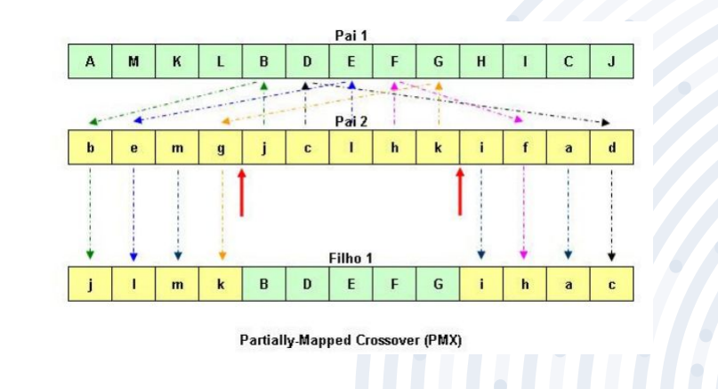

# Partially-Mapped Crossover (PMX) Algorithm

This project implements the Partially-Mapped Crossover (PMX) algorithm in Golang, a recombination method used in genetic algorithms.

## Description

PMX is a crossover operator primarily used for permutation problems, such as the traveling salesman problem. It maintains the relative positions of genes, ensuring that the resulting offspring are valid permutations.

## Project Structure

The project contains the following main structures:

- `Gene`: Represents an individual gene.
- `Chromosome`: Represents a chromosome composed of a sequence of genes.
- `PMX`: Main structure that performs the crossover between two parent chromosomes.

## Algorithm Representation

Below is a visual representation of the PMX algorithm:



## Running the Code

To run the code, ensure you have Go installed and set up on your machine. Clone the repository and execute the following commands:

```bash
git clone https://github.com/joaovds/partially_mapped-crossover.git
cd partially_mapped-crossover
go run main.go

# and you'll see output similar to this:
Crossover Points => Start: 3 End: 8
Parents:
[1 2 3 4 5 6 7 8 9]
[4 5 6 9 8 1 3 2 7]

Children:
[6 5 4 9 8 1 3 2 7]
[3 2 1 4 5 6 7 8 9]
```

## Running with Tests

This project uses the testify package for testing. To run the tests, use the following command:

```bash
go mod tidy
go test ./...
```
